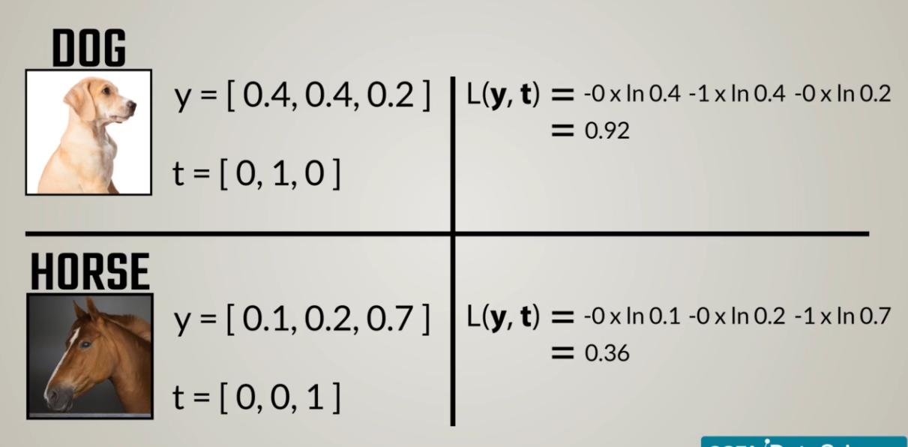
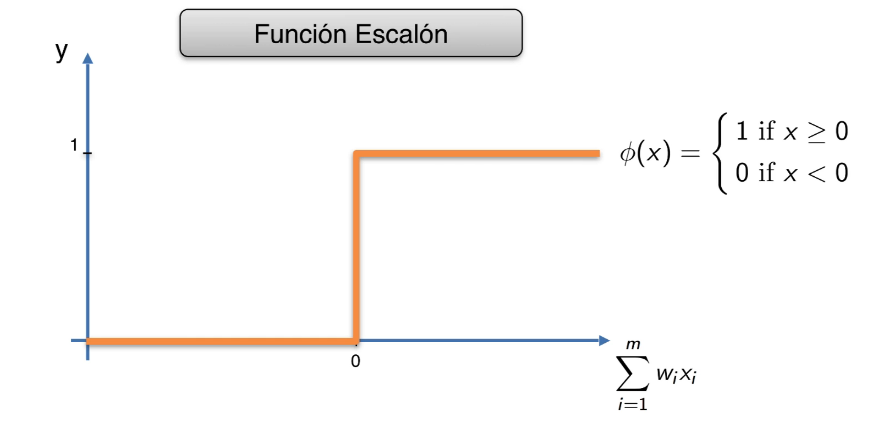
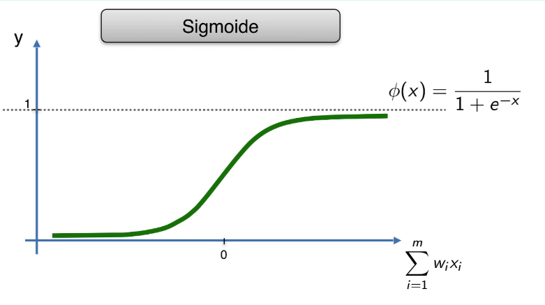
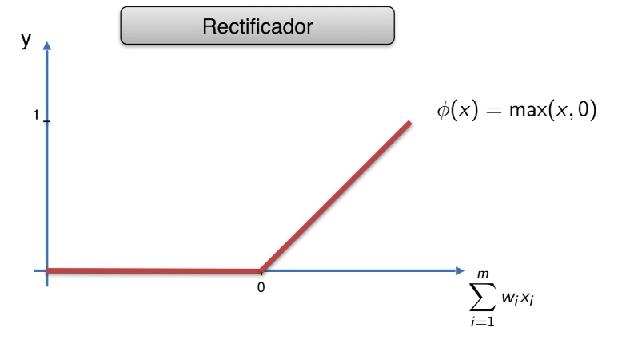
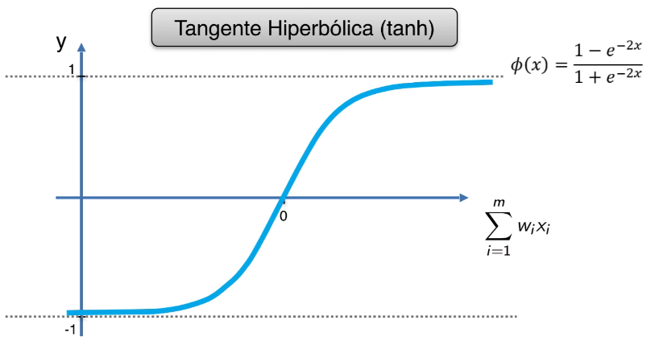

# Indice
- [Funcion de Costo](#funcion-de-costo)
  * [L2-Norm](#l2-norm)
  * [Cross Entropy](#cross-entropy)
- [Gradiante Descendente](#gradiante-descendente)
  * [Gradiante Descendente Estocastico](#gradiante-descendente-estocastico)
- [Backpropagatation](#backpropagatation)
- [Regresin Lineal](#regresin-lineal)
- [SVM](#svm)
- [Random Forest](#random-forest)
- [Deep Learning y Redes Neuronales](#deep-learning-y-redes-neuronales)
- [Funcion de Activacion](#funcion-de-activacion)
  * [Umbral](#umbral)
  * [Sigmoid](#sigmoid)
  * [ReLU (Rectificador Unitario)](#relu--rectificador-unitario-)
  * [Hyper Tangent](#hyper-tangent)
- [Redes Neuronales Artificiales](#redes-neuronales-artificiales)

<small><i><a href='http://ecotrust-canada.github.io/markdown-toc/'>Table of contents generated with markdown-toc</a></i></small>

# Funcion de Costo

## L2-Norm

## Cross Entropy
<br />
<br />

# Gradiante Descendente
se necesita derivar para saber que inclunacion tiene la pendiente, tenemos que tratarr de llegar al punto minimo.

## Gradiante Descendente Estocastico
Se le da un poco de aleatoriedad para mejorar la optimizacion. Tiende a buscar el minimo global

# Backpropagatation
Propagacion hacia atras, vuelve hacia atras en las redes neuronales para correr nuevamente con los nuevos pesos

# Regresin Lineal

# SVM

# Random Forest

# Deep Learning y Redes Neuronales


# Funcion de Activacion

## Umbral


## Sigmoid 
Devuelve un porcentaje <br />


## ReLU (Rectificador Unitario)
Transforma todo lo negativo a cero <br />


## Hyper Tangent
Tangente HIperbolica <br />


#  Redes Neuronales Artificiales
Utilizaremos Relu para que no le de importancia a los valores chicos <br />
Una recomendacion es elegir la media entre la capa entrada y salida para elegir los nodos<br />
El ejemplo es con 11 valores de entraada y 1 de salida
```py
import keras
from keras.models import Sequential
from keras.layers import Dense

classifier = Sequential()

###################
#   Contruccion   #
###################

# input_dim es la dimension de entrada, siempre lo colocamos en la primera capa
# units es el numero de nodos
# kernel_initializer con que distribucion inicializamos los datos
classifier.add(Dense(units = 6, kernel_initializer = "uniform",  
                     activation = "relu", input_dim = 11))

# Solo tengo 1 salida, units = 1
# Utilizamos sigmoid para que me devuelva un porcentaje
classifier.add(Dense(units = 1, kernel_initializer = "uniform",  activation = "sigmoid"))

###################
#   Compilacion   #
###################

# optimizer: Conjunto optimo de pesos en la nn (gd, gde, adam)
classifier.compile(optimizer = "adam", loss = "binary_crossentropy", metrics = ["accuracy"])

#####################
#   Entrenamiento   #
#####################

# batch_size: procesar y corregir
classifier.fit(X_train, y_train,  batch_size = 10, epochs = 100)

#####################
#   Prediccion   #
#####################

y_pred  = classifier.predict(X_test)

#####################
#   Evaluacion   #
#####################

from sklearn.metrics import confusion_matrix
cm = confusion_matrix(y_test, y_pred)

from keras.wrappers.scikit_learn import KerasClassifier
from sklearn.model_selection import cross_val_score

# Adaptamos el clasificador para que tome la evaluacion
def build_classifier():
  classifier = Sequential()
  classifier.add(Dense(units = 6, kernel_initializer = "uniform", activation = "relu", input_dim = 11))
  classifier.add(Dense(units = 6, kernel_initializer = "uniform", activation = "relu"))
  classifier.add(Dense(units = 1, kernel_initializer = "uniform", activation = "sigmoid"))
  classifier.compile(optimizer = "adam", loss = "binary_crossentropy", metrics = ["accuracy"])
  return classifier

classifier = KerasClassifier(build_fn = build_classifier, batch_size = 10, nb_epoch = 100)
accuracies = cross_val_score(estimator=classifier, X = X_train, y = y_train, cv = 10, n_jobs=-1, verbose = 1)
mean = accuracies.mean()
variance = accuracies.std()

```
